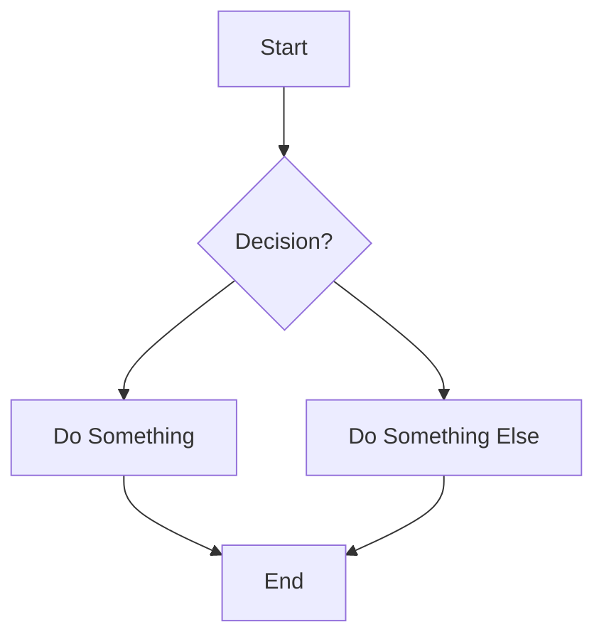

# Mermaid Parser Example

Here's how to use the new mermaid parser with your specific example:

## Input Mermaid Code


## Usage

```typescript
import { mermaidToJson } from '@/utils/mermaidUtils';

const mermaidCode = `
flowchart
    A[Start] --> B{Decision?}
    B --> C[Do Something]
    B --> D[Do Something Else]
    C --> E[End]
    D --> E
`;

const result = mermaidToJson(mermaidCode);
```

## Expected Output

The function will return an object with the exact structure you specified:

```json
{
  "layers": [
    {
      "type": "RECTANGLE",
      "id": "generated-nanoid-1",
      "x": 263.25,
      "y": -464.52,
      "height": 60,
      "width": 200,
      "fill": {
        "r": 255,
        "g": 87,
        "b": 51
      },
      "value": "Start",
      "valueStyle": undefined,
      "borderColor": undefined,
      "borderWidth": undefined,
      "borderType": undefined
    },
    {
      "type": "DIAMOND",
      "id": "generated-nanoid-2", 
      "x": 264.81,
      "y": -262.13,
      "height": 200,
      "width": 200,
      "fill": {
        "r": 77,
        "g": 106,
        "b": 255
      },
      "value": "Decision?",
      "valueStyle": undefined,
      "borderColor": undefined,
      "borderWidth": undefined,
      "borderType": undefined
    }
    // ... more layers for "Do Something", "Do Something Else", "End"
  ],
  "edges": [
    {
      "id": "generated-nanoid-edge-1",
      "arrowStart": undefined,
      "arrowEnd": true,
      "handleStart": "BOTTOM",
      "handleEnd": "TOP", 
      "fromLayerId": "generated-nanoid-1",
      "toLayerId": "generated-nanoid-2",
      "start": {
        "x": 364.25,
        "y": -374.52
      },
      "end": {
        "x": 364.81,
        "y": -292.13
      },
      "controlPoint1": undefined,
      "controlPoint2": undefined,
      "color": {
        "r": 180,
        "g": 191, 
        "b": 204
      },
      "hoverColor": {
        "r": 77,
        "g": 106,
        "b": 255
      },
      "thickness": 2,
      "orientation": "auto",
      "type": "SOLID",
      "shape": "CURVED",
      "label": ""
    }
    // ... more edges for all connections
  ]
}
```

## Key Features

1. **Automatic Layout**: Positions are calculated automatically in a top-down layout
2. **Smart Colors**: "Start" nodes get orange color, decisions get blue diamond shapes
3. **Proper Connections**: Edges are routed with appropriate handle positions
4. **Unique IDs**: All layers and edges get unique nanoid identifiers
5. **Complete Data**: All required properties are filled according to your schema

## Integration

You can now use this in your existing workflow:

```typescript
// Parse mermaid and add to canvas
const { layers, edges } = mermaidToJson(mermaidCode);
setLayers(layers);
setEdges(edges);

// Or export existing canvas to mermaid
const mermaidString = convertToMermaid(currentLayers, currentEdges);
``` 